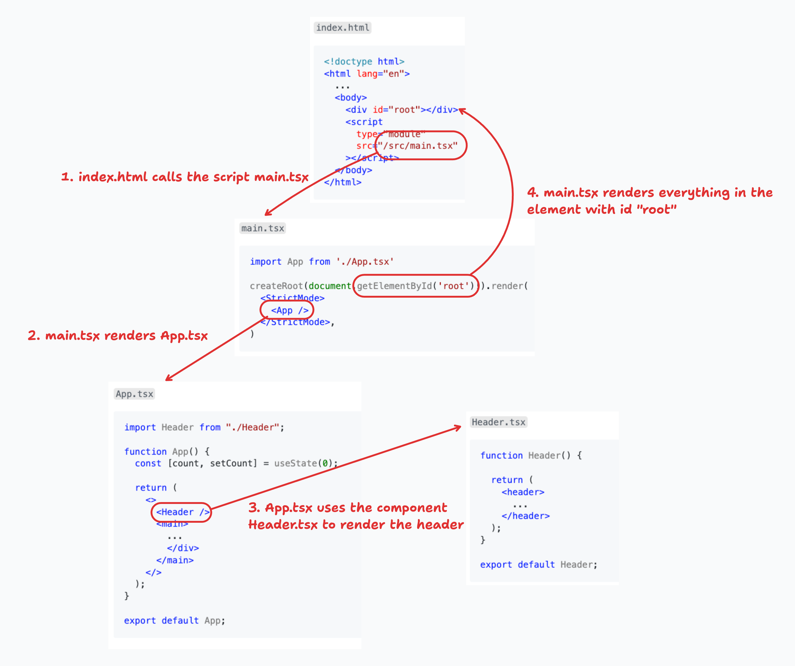
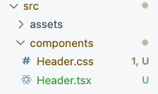

# Learning-React

https://nside.udemy.com/course/react-the-complete-guide-incl-redux/


- [Learning-React](#learning-react)
  - [1. React rendering workflow](#1-react-rendering-workflow)
    - [The complete workflow:](#the-complete-workflow)
  - [2. Concepts](#2-concepts)
    - [Component](#component)
    - [Props (properties)](#props-properties)
      - [Component composition](#component-composition)
  - [3. Events](#3-events)
  - [4. Update the UI: States](#4-update-the-ui-states)
    - [Functions with parameters](#functions-with-parameters)
  - [5. Styling](#5-styling)
    - [Inline styles](#inline-styles)
    - [Conditional styles](#conditional-styles)
    - [Scope CSS to Modules](#scope-css-to-modules)
    - [Styled components](#styled-components)
      - [Conditions in styled components](#conditions-in-styled-components)
  - [Good practices](#good-practices)
    - [Import images as and use them as variables:](#import-images-as-and-use-them-as-variables)
    - [Each `Component` must be in a separate file](#each-component-must-be-in-a-separate-file)


## 1. React rendering workflow

The **entry point** is a simple `html` that calls a first `JSX` file, `main.tsx`.

From that initial `main.tsx` we keep calling other components until we can render the whole page.

`index.html`
```html
<!doctype html>
<html lang="en">
  ...
  <body>
    <div id="root"></div>
    <script 
      type="module" 
      src="/src/main.tsx"
    ></script>
  </body>
</html>
```

`main.tsx`
```tsx
import App from './App.tsx'

createRoot(document.getElementById('root')!).render(
  <StrictMode>
    <App />
  </StrictMode>,
)
```

`Header.tsx`
```tsx
function Header() {

  return (
    <header>
      ...
    </header>
  );
}

export default Header;
```

`App.tsx`
```jsx
import Header from "./Header";

function App() {
  const [count, setCount] = useState(0);

  return (
    <>
      <Header />
      <main>
        ...
        </div>
      </main>
    </>
  );
}

export default App;
```

### The complete workflow:


## 2. Concepts

### Component

`Header.tsx`
```tsx
function Header() {

  return (
    <header>
      ...
    </header>
  );
}

export default Header;
```

Component is a **JSX** function that

- Starts in Upper case
- Returns renderable content
- They're reusable

### Props (properties)

**Props** are parameters you can pass to **Components** constructor. By default, react puts all the **props** are inside the `props` object:

```tsx
// MyComponent.tsx
function MyComponent(props) {
  return (
    <div>{props.prop1}</div>
    <div>{props.prop2}</div>
    <div>{props.prop3}</div>
  );
}

...

// App.tsx
  <MyComponent
    prop1="property 1"
    prop2="property 2"
    prop3="property 3"
  />
```

You can be more explicit using **object destructuring**. For example, this component has the props `image`, `title` and `description`:

`CoreConcept.tsx`
```tsx
function CoreConcept({image, title = "default title", description}) {
  return (
    <li>
      
      <h3>{title}</h3>
      <p>{description}</p>
    </li>
  );
}
```
Pros can have default values

Use it directly passing the parameters or using JS spread operator `...Array` if you have the data in Json format

`App.tsx`
```tsx
<ul>
  <CoreConcept
    title="title"
    description="description"
    image="image.png"
  />
  <CoreConcept {...CORE_CONCEPTS[0]} />
</ul>
```

#### Component composition

When using a components, anything inside the declaration `<Component> Here! <Component/>` is send to the Component constructor in the **prop** `props.children`.

Useful to send text:
```tsx
// TabButton.tsx
export default function TabButton() {
  <button>
    {props.children}
  </button>
}

...
// App.tsx
<TabButton>Button text</TabButton>
```

Compatible with deconstruction
```tsx
// TabButton.tsx
export default function TabButton({children}) {
  <button>
    {children}
  </button>
}
```

## 3. Events

Define a function in a **component** and use it in the return statement.
Remember that the scope of the function `handleClick()` is restricted to `TabButton.tsx`. 

`TabButton.tsx`
```tsx
export default function TabButton({children}) {
  function handleClick() {
    console.log('Click!');
  }
  
  return (
    <li>
      <button onClick={handleClick}>{children}</button>
    </li>
  );
}
```

Pass the function as **prop** to the **component**. 

This pattern is useful because now the scope of `handleClick()` is `App.tsx` since the function is defined there. So it can modify the view there but is still used in `TabButton.tsx`.

`TabButton.tsx`
```tsx
export default function TabButton({children, onSelect}) {
  
  return (
    <li>
      <button onClick={onSelect}>{children}</button>
    </li>
  );
}
```
`App.tsx`
```tsx
function handleSelect() {
  console.log('passed function to Click!');
}

<ul>
  <TabButton onSelect={handleSelect}>Button Text</TabButton>
</ul>
```

## 4. Update the UI: States

To tell React that it has to re-render a component, we need to use the hook `useState()`. 

```tsx
const [currentStateValue, updatingFunction] = useState('initialValue');
```

A hook is a function that must be used at top level of a `component`.

We pass the initial value to `useState(initialValue)` and it returns 2 things: 
- `currentStateValue`: the current state value that may change next time the function is executed
- `updatingFunction()`: 
  - The function `updatingFunction()` accepts a value that will be assigned to `currentStateValue` updating it
  - It can also accept **another** function whose result will be stored in  `currentStateValue` updating it's value.
  - The fact that `currentStateValue` is updated, will trigger React to render again the **component**
  - If `currentStateValue` is used in the view, it will be rendered with the updated value

Initially count is `0`. We pass a function to `setCount()` that takes `count` as parameter and adds one to it. Every time user clicks on button, it will add 1 to count and re-render the component:
```tsx
import { useState } from "react";

function App() {
  const [count, setCount] = useState(0);

  return (
    ...
    <button onClick={() => setCount((count) => count + 1)}>
      count is {count}
    </button>
    ...
  )
```

We can also use setCount inside a function and just pass the new value to it:

```tsx
function App() {
  const [selectedTopic, setSelectedTopic] = useState();

  function handleSelect(selectedButton) {
    setSelectedTopic(selectedButton);
  }

  ...
  return (
    ...
    <TabButton onSelect={() => handleSelect('components')}>
      Components
    </TabButton>
```

### Functions with parameters

The anonymous function we pass to the component can have parameters:

`App.tsx`
```tsx
function App() {

  function handleSelect(selectedButton) {
    console.log(selectedButton);
  }

...
return (
  ...

  <menu>
    <TabButton onSelect={() => handleSelect('components')}>
      Components
    </TabButton>
    <TabButton onSelect={() => handleSelect('jsx')}>
      JSX
    </TabButton>
  ...
)
```

## 5. Styling
  
> [!WARNING]  
> Remember that styles defined in a CSS component **will be applied to the whole App!!**

### Inline styles

Set style directly in a component TS code:
```ts
<h2>I have default h2 style</h2>
<h2 style={{
  color: '#a1ef06',
  background: '#ea00ff' 
}}>I have inline h2 style</h2>
```

### Conditional styles

You can define a condition in the style based on a property. 
Can do the same with classes, but remember to return an `undefined` class for one of the cases.

```ts
const emailNotValid = submitted && !enteredEmail.includes('@');

return (
  ...
  <input
    type="email"
    style={emailNotValid ? 'red' : 'green'}
    className={emailNotValid ? 'invalid' : undefined}
    onChange={(event) => handleInputChange('email', event.target.value)}
  />
)
```

To mix conditional and permanent classes:

```ts
<input
  type="email"
  className={`label ${emailNotValid ? 'invalid' : ''}`}
/>
```

### Scope CSS to Modules

Convert the css files into modules. Then you can import them as an objects in the **components** and use the css classes as properties to apply them to different elements

```ts
import classes from ./Header.module.css
...
<p className={classes.paragraph}>
```

### Styled components

Use styled components to re-define html tags with specific style.

Install and import:
```sh
npm install styled-components
```
```ts
import { styled } from 'styled-components';
```

Create and use tagged templates in `components`. For example here we re-define the `input` element
```ts
const Input = styled.input`
  width: 100%;
  padding: 0.75rem 1rem;
`;

return (
  ...
    <Input
      type="email"
      className={emailNotValid ? 'invalid' : undefined}
    />
```

`Input` will be replaced with an `input` with the defined properties. Then you can delete the input css rules.

#### Conditions in styled components

All the properties defined inside a Styled component are accesible from the component itself. This can be used to define conditions. Those properties needs a `$` before the name

For example here:
1. Input is used with the property `$invalid`
2. `$invalid` value depends on the function `passwordNotValid`
3. We use `$invalid` value as condition for the color

```ts
const Input = styled.input`
  color: ${({ $invalid }) => ($invalid ? '#ef4444' : '#374151')};
`;
const passwordNotValid = submitted && enteredPassword.trim().length < 6;

return (
  ...
  <Input $invalid={passwordNotValid}/>

```

## Good practices

### Import images as and use them as variables:
```tsx
import reactLogo from "./assets/react.svg";
import viteLogo from "/vite.svg";

...

```

### Each `Component` must be in a separate file

- File has same name as **Component**
- **Components** are under `src/components` folder. You can add as many subfolder as you want but remember to adapt the paths
- Export the component to make them accessible for other components 
```tsx
// In src/components/YourComponent.tsx
import reactLogo from "../assets/react.svg"; // adapt url to ../assets

export default function YourComponent() { ... }
...
// In App.tsx
import Header from "./components/YourComponent.tsx";
```
- Style files (CSS) related to a component are next to it using the same name
  - ❗Styles defined in a CSS component **will be applied to the whole App!!**



Import and use it:
```tsx
import "./Header.css"

export default function Header() { ... }
```

- Functions received as props in component must start with `on`
```tsx
export default function TabButton({children, onSelect, onClick, ...}) {
```