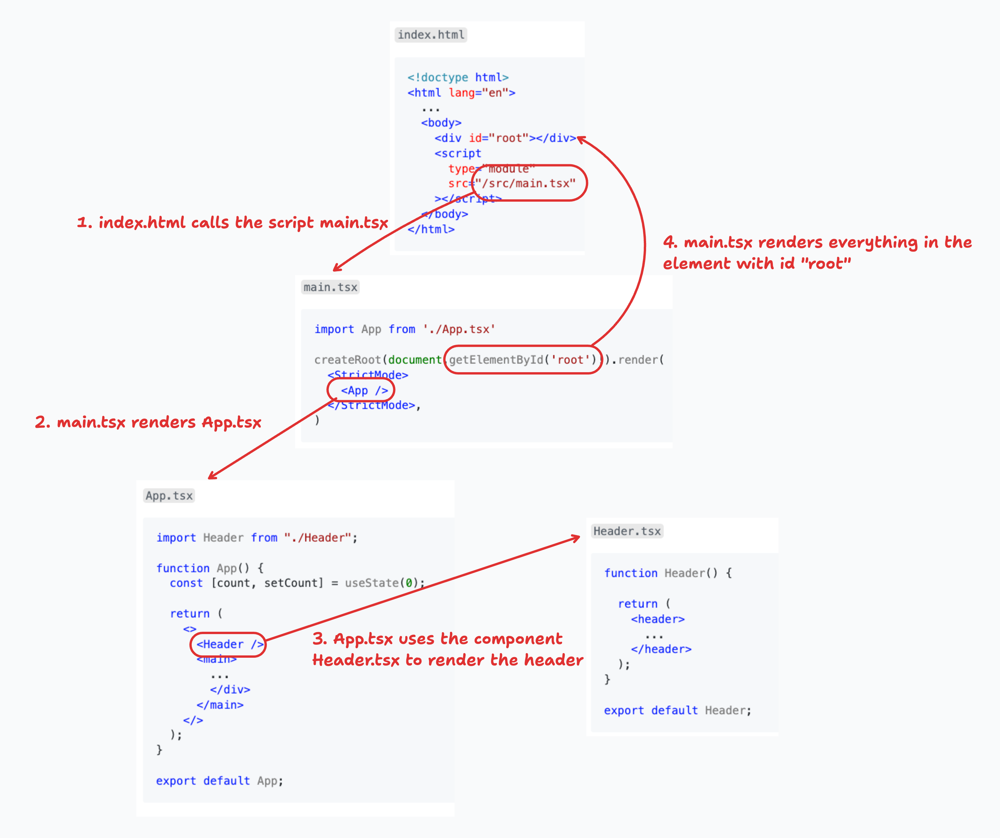
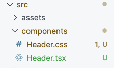
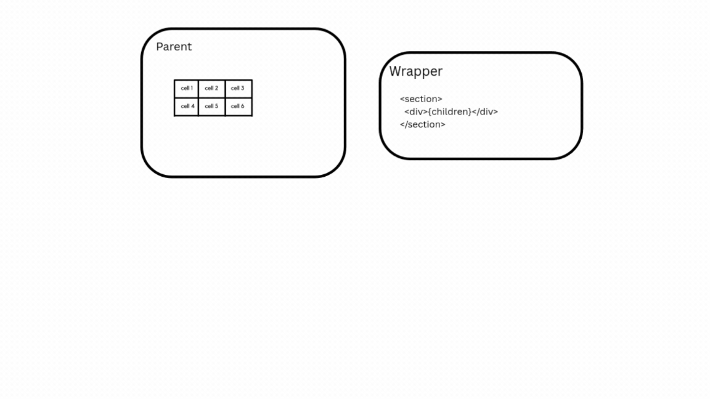
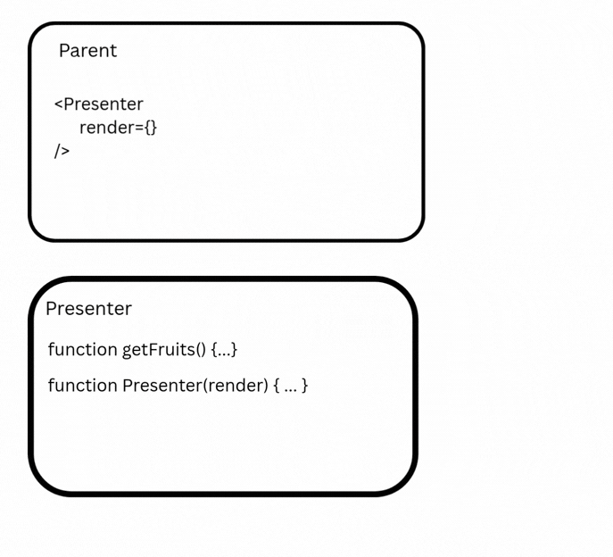
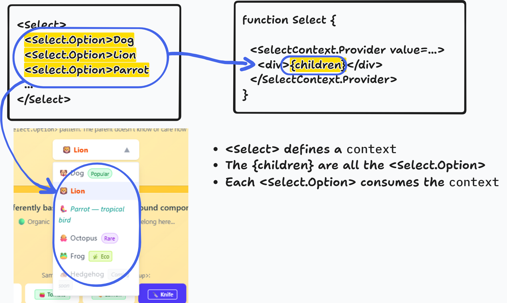

# Learning-React

https://nside.udemy.com/course/react-the-complete-guide-incl-redux/


- [Learning-React](#learning-react)
  - [React \& TypeScript Basics](#react--typescript-basics)
    - [React rendering workflow](#react-rendering-workflow)
      - [The complete workflow:](#the-complete-workflow)
    - [State](#state)
    - [Type](#type)
    - [Debugging react apps](#debugging-react-apps)
    - [Good practices](#good-practices)
      - [Import images and use them as variables:](#import-images-and-use-them-as-variables)
      - [Each `Component` should be in a separate file](#each-component-should-be-in-a-separate-file)
  - [Component](#component)
    - [Props (properties)](#props-properties)
      - [Object destructuring](#object-destructuring)
    - [Component composition](#component-composition)
    - [Fragment](#fragment)
    - [Events](#events)
      - [Functions with parameters](#functions-with-parameters)
  - [Styling](#styling)
    - [How to apply styles to a component](#how-to-apply-styles-to-a-component)
      - [Global CSS files (👎 not recommended for large apps)](#global-css-files--not-recommended-for-large-apps)
      - [CSS Modules (👍👍 recommended)](#css-modules--recommended)
      - [Inline styles / styled-components (👍 acceptable)](#inline-styles--styled-components--acceptable)
      - [Conditions in styled-components](#conditions-in-styled-components)
  - [Hooks](#hooks)
    - [Custom Hooks](#custom-hooks)
    - [useState()](#usestate)
    - [useRef()](#useref)
    - [useEffect()](#useeffect)
    - [useQuery()](#usequery)
  - [Router](#router)
  - [Component Composition \& Reusability](#component-composition--reusability)
    - [Component Composition via Children](#component-composition-via-children)
    - [Presenter pattern](#presenter-pattern)
    - [Compound components pattern](#compound-components-pattern)


## React & TypeScript Basics

### React rendering workflow

The **entry point** is a simple `HTML` that loads an initial JSX file, `main.tsx`.

From that initial `main.tsx` we keep calling other components until we can render the whole page.

`index.html`
```html
<!doctype html>
<html lang="en">
  ...
  <body>
    <div id="root"></div>
    <script 
      type="module" 
      src="/src/main.tsx"
    ></script>
  </body>
</html>
```

`main.tsx`
```tsx
import React from 'react';
import { createRoot } from 'react-dom/client';
import App from './App.tsx';

createRoot(document.getElementById('root')!).render(
  <React.StrictMode>
    <App />
  </React.StrictMode>,
);
```

`Header.tsx`
```tsx
function Header() {

  return (
    <header>
      ...
    </header>
  );
}

export default Header;
```

`App.tsx`
```tsx
import React, { useState } from 'react';
import Header from './Header';

function App() {
  const [count, setCount] = useState(0);

  return (
    <>
      <Header />
      <main>
        ...
      </main>
    </>
  );
}

export default App;
```

#### The complete workflow:


### State

State is the memory of a specific component. It's data that can change over time and affects what is rendered on the screen. 
When state changes, React re-renders the component to reflect the new state.

### Type

Defines the shape of data. For example, a `User` type with `name` and `age` properties:

```tsx
type User = {
  name: string;
  age: number;
};
```

### Debugging react apps
- Find the sources in Chrome DevTools and put breakpoints where needed.
- In StrictMode (development), React intentionally mounts and unmounts components twice to help surface side-effects.
- React DevTools: Install the browser extension for inspecting component trees and hooks.

### Good practices

#### Import images and use them as variables:
```tsx
import reactLogo from './assets/react.svg';
import viteLogo from '/vite.svg';

...

```

#### Each `Component` should be in a separate file

- File has same name as the component
- Components live under `src/components`. You can add subfolders as needed, adjusting import paths.
- Export the component to make it accessible to other files.
```tsx
// In src/components/YourComponent.tsx
import reactLogo from '../assets/react.svg'; // adapt url to ../assets

export default function YourComponent() { return <div /> }
// In App.tsx
import Header from './components/YourComponent.tsx';
```
- Style files (CSS) related to a component are typically colocated next to it using the same base name.
  - ❗Styles defined in a global CSS file will affect the whole app unless you scope them with CSS Modules.



Import and use it:
```tsx
import './Header.css'

export default function Header() { return <header /> }
```

- Functions received as props that are event handlers should start with `on` (e.g., `onClick`, `onSelect`).

```tsx
export default function TabButton({ children, onSelect }: { children?: React.ReactNode; onSelect?: () => void }) {
  return (
    <li>
      <button onClick={onSelect}>{children}</button>
    </li>
  );
}
```

Note: when rendering lists, always provide a unique `key` prop for each item to help React optimize rendering.

Useful links:

- React Hooks: https://reactjs.org/docs/hooks-intro.html
- React Fragments: https://reactjs.org/docs/fragments.html


## Component

`Header.tsx`
```tsx
function Header() {

  return (
    <header>
      ...
    </header>
  );
}

export default Header;
```

A component is a JavaScript/TypeScript function that returns JSX.

- Starts with an uppercase name
- Returns renderable content
- Is reusable and composable

### Props (properties)

**Props** are parameters you can pass to components. By default, React provides all props on the `props` object:

```tsx
// MyComponent.tsx
function MyComponent(props) {
  return (
    <>
      <div>{props.prop1}</div>
      <div>{props.prop2}</div>
      <div>{props.prop3}</div>
    </>
  );
}

// App.tsx
  <MyComponent
    prop1="property 1"
    prop2="property 2"
    prop3="property 3"
  />
```

#### Object destructuring

You can be more explicit using **object destructuring**. For example, this component has the props `image`, `title`, and `description`:

`CoreConcept.tsx`
```tsx
function CoreConcept({ image, title = 'default title', description }: { image: string; title?: string; description?: string }) {
  return (
    <li>
      
      <h3>{title}</h3>
      <p>{description}</p>
    </li>
  );
}
```

Props can have default values.

Use props by passing parameters directly or by using the JS spread operator `...` when the data comes from an object (e.g., JSON):

`App.tsx`
```tsx
<ul>
  <CoreConcept
    title="title"
    description="description"
    image="image.png"
  />
  <CoreConcept {...CORE_CONCEPTS[0]} />
</ul>
```

### Component composition

When using a component, anything between `<Component>...</Component>` is provided to the component as `props.children`.

Useful to send text:
```tsx
// TabButton.tsx
export default function TabButton() {
  <button>
    {props.children}
  </button>
}

...
// App.tsx
<TabButton>Button text</TabButton>
```

Compatible with destructuring:
```tsx
// TabButton.tsx
export default function TabButton({ children }: { children?: React.ReactNode }) {
  return (
    <button>
      {children}
    </button>
  );
}
```

### Fragment

In a `Component`, you can't return 2 sibling elements:
```tsx
return (
  <h2>Welcome!</h2>
  <p>React is awesome!</p>
);
```

You could solve this by wrapping the elements in a `div`
```tsx
return (
  <div>
    <h2>Welcome!</h2>
    <p>React is awesome!</p>
  </div>
);
```

But maybe you don't want to add that extra element to the page 🙁

With "React Fragment" you can solve this!

```tsx
import { Fragment } from 'react';
 
// ... other code ...
 
return (
  <Fragment>
    <h2>Welcome!</h2>
    <p>React is awesome!</p>
  </Fragment>
);

```
Shorter form:

```tsx
// no import needed
 
return (
  <>
    <h2>Welcome!</h2>
    <p>React is awesome!</p>
  </>
);
```

### Events

Define a function in a component and pass it to the element via an event handler. The function's scope is the component where it's defined.

`TabButton.tsx`
```tsx
export default function TabButton({children}) {
  function handleClick() {
    console.log('Click!');
  }
  
  return (
    <li>
      <button onClick={handleClick}>{children}</button>
    </li>
  );
}
```

Pass the function as **prop** to the **component**. 

This pattern is useful because now the scope of `handleClick()` is `App.tsx` since the function is defined there. So it can modify the view there but is still used in `TabButton.tsx`.

`TabButton.tsx`
```tsx
export default function TabButton({children, onSelect}) {
  
  return (
    <li>
      <button onClick={onSelect}>{children}</button>
    </li>
  );
}
```
`App.tsx`
```tsx
function handleSelect() {
  console.log('passed function to Click!');
}

<ul>
  <TabButton onSelect={handleSelect}>Button Text</TabButton>
</ul>
```

#### Functions with parameters

The anonymous function we pass to the component can have parameters:

`App.tsx`
```tsx
function App() {

  function handleSelect(selectedButton: string) {
    console.log(selectedButton);
  }

  return (
    <menu>
      <TabButton onSelect={() => handleSelect('components')}>
        Components
      </TabButton>
      <TabButton onSelect={() => handleSelect('jsx')}>
        JSX
      </TabButton>
    </menu>
  );
}
```


## Styling

### How to apply styles to a component

#### Global CSS files (👎 not recommended for large apps)

Define the styles in a separate CSS file and import it in the component. 

* ✅ Easy to implement
* ❌ Styles are global and will be applied to the whole app, not just the component

**MyComponent.css**
```css
.red-label {
  color: red;
}
```

**MyComponent.tsx**
```tsx
import './MyComponent.css';

export default function MyComponent() {
  return (
    <label className="red-label">
      This text will be red
    </label>
  );
}
```

> [!WARNING]
> Remember that styles defined in a global CSS file will be applied to the whole app unless scoped (e.g., CSS Modules).
 
**MyOtherComponent.tsx**
```tsx
export default function MyOtherComponent() {
  return (
    <label className="red-label">
      This text will be red in ALL THE COMPONENTS because the styles are global
    </label>
  );
}
```


#### CSS Modules (👍👍 recommended)

Define the styles of a component in a file with the same name. Then import the styles as an object and use the properties of that object to apply the styles to the elements.

* ✅ Styles are scoped to the current component
* ✅ Styles are reusable and easy to maintain
* ✅ No runtime overhead because styles are generated at build time

> [!INFO]
> If your class has special characters like `-` you need to use square brackets to access it: `styles['my-class']` instead of `styles.my-class`. Prefer camelCase class names to use `styles.someClass`.

**MyComponent.module.css**
```css
.red-label {
  color: red;
}
```

**MyComponent.tsx**
```tsx
import styles from './MyComponent.module.css';

export default function MyComponent() {
  return (
    <label className={styles['red-label']}>
      This text will be red only in this component
    </label>
  );
}
```

#### Inline styles / styled-components (👍 acceptable)

Set style directly in a component or use a CSS-in-JS library such as styled-components.

* ✅ Styles scoped to the current component
* ✅ Compatible with conditional styles logic
* ❌ Adds runtime overhead in some libraries because styles are created at runtime
* ❌ Some approaches generate classnames that are harder to debug

**MyComponent.tsx**
```tsx
import styled from 'styled-components';

const RedLabel = styled.label`
  color: red;
`;

export default function MyComponent() {
  return (
    <RedLabel>
      This text will be red only in this component
    </RedLabel>
  );
}
```

#### Conditions in styled-components

Styled-components (and similar libraries) let you access props inside the styled definition to conditionally set styles. When passing non-DOM props to styled-components, it's a common convention to prefix transient props with `$` to avoid them being forwarded to the underlying DOM element.

Example:

```tsx
import styled from 'styled-components';

const Input = styled.input<{ $invalid?: boolean }>`
  color: ${({ $invalid }) => ($invalid ? '#ef4444' : '#374151')};
`;

const passwordNotValid = submitted && enteredPassword.trim().length < 6;

return (
  <Input $invalid={passwordNotValid} />
);
```

## Hooks

Hooks are special functions that allow you to use (update) `state` in a `component`.
They must be used at the top level of a component (no conditional or nested calls).

### Custom Hooks

You can define a hook in a separate file and reuse it across components. 
Just import the hook in your component and it will update its

1. Define the hook `useCounter()` in `src/hooks/useCounter.tsx`:
```tsx
import { useState } from 'react';

export function useCounter(initialValue = 0) {
  const [count, setCount] = useState(initialValue);

  const increment = () => setCount(prev => prev + 1);
  const decrement = () => setCount(prev => prev - 1);

  // We return the data and the functions so components can use them
  return { count, increment, decrement };
}
```

2. Use the hook in a component. 
When the component calls `useCounter()`, it returns methods and a variable that are managed by `useState()`.
```tsx
import { useCounter } from '../hooks/useCounter';

function MyButton() {
  // We "plug in" the hook here!
  const { count, increment } = useCounter(10); 

  return <button onClick={increment}>Count is {count}</button>;
}
```

### useState()

Returns a value and a setter function to update the value. Attacht it to a component to make it reactive. When the value changes, the component re-renders to reflect the new state.

> [!IMPORTANT]
> Re-render the component means that the constructor function `export default function MyComponent() { ... }` is called again and the JSX is re-evaluated to update the DOM.

In this example:
* Initially `count` is `0`
* We pass a function to `setCount(c)` where `c` is the current value of `count` and add `1` to it
* We attatch `setCount()` to a button to use it
* Every time the user clicks on the button, it will add 1 to `count` 
* This will re-render the component executing the functon `App()` again to update the DOM with the new value of `count`

```tsx
import { useState } from 'react';

function App() {
  const [count, setCount] = useState(0);

  return (
    <button onClick={() => setCount((c) => c + 1)}>
      count is {count}
    </button>
  );
}
```

We can also use `setCount` inside a function and just pass the new value to it:

```tsx
import { useState } from 'react';

function App() {
  const [count, setCount] = useState(0);

  function handleIncrement() {
    // compute the new value and pass it to setCount
    setCount(count + 1);
  }

  return (
    <button onClick={handleIncrement}>
      count is {count}
    </button>
  );
}
```

> [!WARNING]
> An `useState()` function declared in a component will always trigger a re-render even if is not explicity use in the Component DOM (the `return (...)` statement). 
> **This could be the source of some performance issues.**

### useRef()

It's a pointer. Keeps a reference (for example, to a DOM element) that doesn't trigger a re-render when it changes.
```tsx
import React, { useRef } from 'react';

export default function YourComponent() {
  // theReference will point to an input element and is initialized with `null`.
  const theReference = useRef<HTMLInputElement | null>(null);

  function focusReferencedInput() {
    theReference.current?.focus();
  }

  // ✅ Here is when we connect the pointer `theReference` to the Input element. 
  return (
    <>
      <input ref={theReference} />
      <button type="button" onClick={focusReferencedInput}>
        Focus Email
      </button>
    </>
  );
}
```

### useEffect()

Is the "Action" or "Side Effect". Something that happens outside of React's world 🛸 like fetching data from an API, manually changing the browser's title, listening for window resizing, etc.


```tsx
useEffect(() => { 
  ... 
  return () => { ... }
}, [])
```

1.  **Effect function** `() => { ... }`: The logic you want to run after the component renders. This can include side effects like fetching data, setting up event listeners, or updating the DOM.
2.  **Cleanup function** `return () => { ... }`: Optional. If you return a function from the effect, React will call it before the component unmounts or before running the effect again on subsequent renders. This is useful for cleaning up resources like event listeners or timers and prevent race conditions on HTTP request aborting them before launching a new one.
3.  **Dependency array** `[]`: If empty, the effect runs only once after the initial render. If it contains variables, the effect runs after every render where those variables change.

```tsx
import React, { useState, useEffect } from 'react';

function ScreenSizeMonitor() {
  const [windowWidth, setWindowWidth] = useState(window.innerWidth);

  useEffect(() => {
    // 1. Effect function
    const handleResize = () => {
      setWindowWidth(window.innerWidth);
    };

    window.addEventListener('resize', handleResize);

    console.log("Effect: Event listener added!");

    // 2. Cleanup function
    return () => {
      window.removeEventListener('resize', handleResize);
      console.log("Cleanup: Event listener removed!");
    };
  }, []); // 3. Dependency array (empty means this effect runs only once)

  return (
    <div style={{ padding: '20px', border: '1px solid #ccc' }}>
      <h2>Screen Monitor</h2>
      <p>Your current window width is: <strong>{windowWidth}px</strong></p>
      {windowWidth < 600 ? <p>📱 You are on a mobile view</p> : <p>💻 You are on a desktop view</p>}
    </div>
  );`
}
```

> [!CAUTION]
> Would this code work without `useEffect()`? Yes. 
> **But it would add a new event listener every time the component re-renders** causing performance issues and memory leaks.

### useQuery()

This is a custom hook provided by TanStack Query (a popular library for data fetching and caching in React). It abstracts away the logic for fetching data and managing loading and error states.

To make a HTTP request in a React component you need:
1. The UI: This is the component where for example user inputs the data and clicks to start the request. It's also where you want to show the loading state and the response data.
2. The Hook: The bridge between the Component and the API. Manages the cache keys, the loading states, and the retries.
3. The API: The function that makes the actual HTTP request and returns the data. This is native web API, nothing React-specific.

**1. MyComponent.tsx**
```tsx
import { useMyRequest } from '../hooks/useMyRequest';
import type { ResponeData } from '../api/myApi';

export default function MyComponent() {
  const [query, setQuery] = useState<string | null>(null);
  const { data, isLoading, error } = useMyRequest(query); // 2. Use the hook in the component
  
  // 1. Prepare the query to send it to the hook
  function handleSearch() {
    setQuery(userQuery.trim() || null));
  }
    
  return (
    <div>
      <input type="text" value={userQuery} onChange={(e) => setUserQuery(e.target.value)} />
      <button onClick={handleSearch}>Search</button>

      {isLoading && <p>Loading...</p>}
      {error && <p>Error: {error.message}</p>}
      {data && <pre>{JSON.stringify(data, null, 2)}</pre>}
    </div>
  );
}
```

**2. useMyRequest.ts**
```tsx
import { useQuery } from '@tanstack/react-query';
import { fetchMyData } from '../api/myApi';

export function useMyRequest(query: string | null) {
  return useQuery<ResponeData, Error>({
    queryKey: ['myData', query], // Unique key for caching
    queryFn: () => fetchMyData(query!), // Function that makes the API request
    enabled: !!query, // Only run the query if there is a valid query string
    retry: 2, // Retry failed requests up to 2 times
  });
}
```

**3. myApi.ts**
```tsx
export type ResponeData = {
  id: number;
  name: string;
  // other fields...
};

export async function fetchMyData(query: string): Promise<ResponeData> {
  const response = await fetch(`https://api.example.com/data?search=${encodeURIComponent(query)}`);
  if (!response.ok) throw new Error('Network response was not ok');
  return response.json();
}
```

## Router

Routes is a map that tells React what to render depending on the url.

In React there's only one single html page (the one we load in `index.html`) and we render different components based on the URL. To manage this, we can use a routing library like `react-router-dom`.

When the user clicks on a link:
1. The Router intercepts the click.
2. It updates the URL in the address bar (e.g., from / to /search).
3. React looks at its "map" and says, "Oh, the URL is now /search. I will throw away the Home component and render the Search component instead."

First, install it:
```bash
npm install react-router-dom
```

This is how a `Route` looks like:
* `Routes` is the parent component that wraps all the `Route` components. It listens to URL changes and renders the matching route.
  * `Route` define a route. It has those elements:
    * `path`: the URL that triggers this route (e.g., `/search`).
    * `element`: the component that will be rendered when the URL matches the path. You can also pass props to this component if needed.

> [!Catuion]
> Components defined outside the `Routes` block will be rendered on every page. This is useful for components like `Navigation` that should be visible on all pages.

How to change the URL: 
* `Link`/`NavLink`: A classic anchor tag replacement. Updates the URL **when user clicks on it**.  
* `useNavigate`: Function that changes the url from code. Similar to `window.location.href = '/search'` but without reloading the page. Useful for programmatic navigation (e.g., redirect after form submit). 
* `useParams`: Hook that allows you to access the dynamic segments of the URL. For example, if the URL is `/user/123`, `useParams()` will return `{ id: '123' }`.

**App.tsx**
```tsx
<Routes>
  <Route path="/" element={<Home />} />
  <Route path="/about" element={<About />} />
  <Route path="/routeurl" element={<MyComponent someProp={someValue} />} />
  <Route path="/routewithparams/:id/:name" element={<ComponentWithParams />} />
</Routes>
<ComponentOutsideRoutes />
```

**MyComponent.tsx**
```tsx
import { Link } from 'react-router-dom';
export default function MyComponent({ someProp }) {

  const navigate = useNavigate();

  function moveToOtherPage() {
    console.log("User is leaving the page...");
    navigate("/otherpage");
  }

  return (
    <div>
      <h1>My Component</h1>
      <p>Prop value: {someProp}</p>
      <Link to="/">Go back to Home</Link>
      <Link to="/search">Go to Search</Link>
      <Link to="/routewithparams/123/john">Link to Route with Params</Link>
      <button onClick={() => navigate(-1)}>Go back</button>
      <button onClick={moveToOtherPage}>Go to Other Page</button>
      <button onClick={() => navigate('/routewithparams/456/jane')}>Navigate to Route with Params with different values</button>
    </div>
  );
}
```

**ComponentWithParams.tsx**
```tsx
import { useParams } from 'react-router-dom';
export default function ComponentWithParams() {
  const { id, name } = useParams();

  return (
    <div>
      <h1>Component with Params</h1>
      <p>ID: {id}</p>
      <p>Name: {name}</p>
    </div>
  );
}
```

## Component Composition & Reusability

### Component Composition via Children



Create a component that accepts `children` to create a flexible wrapper. This allows you to compose different UIs without duplicating layout styles.

The `Wrapper` component will render the children in a section. The `children` can be any valid JSX: text, HTML elements, or even other components.

```tsx
type WrapperProps = {
  title?: string;
  children: ReactNode;
};

export default function Wrapper({
  title,
  children
}: WrapperProps) {
  return (
    <section>
      {title && <h3>{title}</h3>}
      <div>{children}</div>
    </section>
  );
}

//Usage in Parent component:

// Children is a <p> element
<Wrapper title="Card Title">
  <p>This is the content of the card.</p>
</Wrapper>
// Children is AnotherComponent
<Wrapper title="Another Card">
  <AnotherComponent />
</Wrapper>
```

In this case, the **parent** sends already-build UI as children. The **child** (the `FlexibleCard` component) just renders it in a section with a title.

### Presenter pattern



A presenter component defines a behavior but not a specific UI. Doesn't know how to render itself. Is the parent who defines the UI and provide it via prop.

In this example of `Presenter`:
* The `Presenter` behavior is: pick 3 random elements and render them.
* The `Presenter` doesn't know how to render those elements.
* The `Parent` sends the UI via the `render` prop, which is a function that returns a `ReactNode`.
* The parent can pass different UIs every time. 

```tsx
// Presenter props is a function that returns a ReactNode. This ReactNode is the UI provided by the parent.
type PresenterProps = {
  render?: (props: {
    elements: string[];
    pickElements: () => void;
  }) => ReactNode;
};

// The presenter logic to get and pick elements
const elements = ['Element 1', 'Element 2', ...];
function pickElementsLogic(elementsList: string[]): string[] { ... }

export default function Presenter({ render }: PresenterProps) {
  const [elementsState, setElementsState] = useState<string[]>(() => pickElementsLogic(elements));

  const pickElements = () => {
    setElementsState(pickElementsLogic(elements));
  };

  return <>{render({ elements: elementsState, pickElements })}</>;
}
```

Usage:
```tsx
// Parent tells how to render the presenter by passing a function as prop
<Presenter
  render={({ elements, pickElements }) => (
    <div>
      <h2>Random Users</h2>
      <ul>
        {elements.map((element) => (
          <li key={element}>{element}</li>
        ))}
      </ul>
      <button onClick={pickElements}>Pick New Elements</button>
    </div>
  )}
/>
// rendering using a custom ElementCard component
<Presenter
  render={({ elements, pickElements }) => (
    <div>
      <h2>Random Elements</h2>
      {elements.map((element) => (
        <ElementCard key={element} name={element} />
      ))}
      <button onClick={pickElements}>Pick New Elements</button>
    </div>
  )}
/>
```

### Compound components pattern

When you have elements that belong to a common parent and need to share state, you can use the compound components pattern. 

- `Compound`: The parent component that manages the state and provides it to its children via context.
- `Sub-components`: The child components that consume the state from the parent via context.

> [!TIP]
> Sub-components can use the children prop to render any content passed by the parent, making them flexible and reusable.

Typical examples in HTML are `<select>` and `<option>` dropdown. We can do the same in React by creating a parent component that manages the state and child components that consume that state via context:

```tsx
export function Select({ children }: { children: React.ReactNode }) {
  const [selectedValue, setSelectedValue] = useState('');

  // Create a context to share the selected value and the function to update it with the child components
  const SelectContext = createContext<SelectContextValue | null>(null);

  // Function to update the selected value when an option is clicked
  const handleSelect = (value: string) => {
    setSelectedValue(value);
  };

  // Children will be the Option components that consume the context to know if they are selected and to update the selected value when clicked
  return (
    <SelectContext.Provider value={{ selectedValue, onSelect: handleSelect }}>
      <div>{children}</div>
    </SelectContext.Provider>
  );
}

function Option({ value, children }: { value: string; children: React.ReactNode }) {
  // The option consumes the context to know if it's selected and to update the selected value when clicked
  const { selectedValue, onSelect } = useContext(SelectContext);
  const isSelected = selectedValue === value;

  return (
    <div onClick={() => onSelect(value)} style={{ fontWeight: isSelected ? 'bold' : 'normal' }}>
      {children}
    </div>
  );
}
```

Usage:


```tsx
<Select>
  <Select.Option value="option1">Option 1</Select.Option>
  {// can add whatever content we want in the option, it will be rendered as children}
  <Select.Option value="option2">Option 2 <span>Extra Content</span></Select.Option>
  <Select.Option value="option3">Option 3</Select.Option>
</Select>
```
